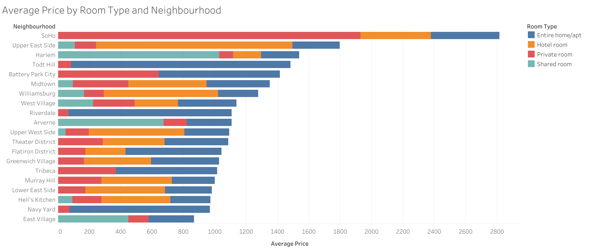
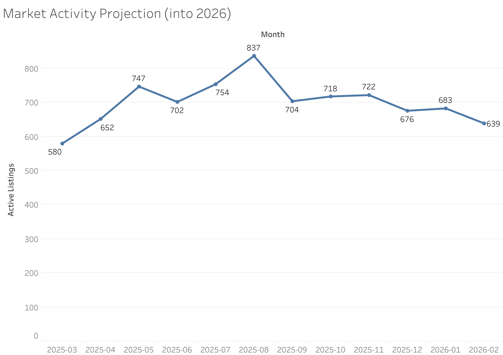
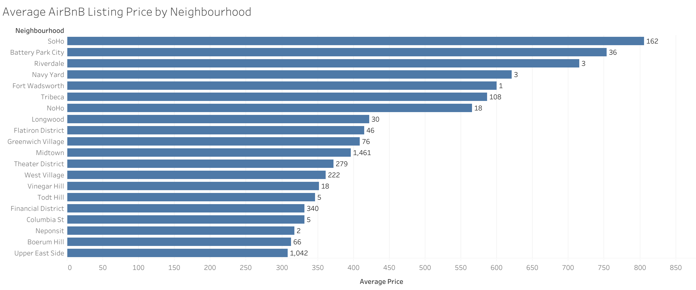

# Airbnb Market Analysis

This project explores short-term rental trends using real data from [Inside Airbnb](http://insideairbnb.com/get-the-data.html). The goal is to uncover pricing patterns, revenue dynamics, guest sentiment, and neighborhood trends to better understand what drives performance on the Airbnb platform.

---

## Purpose

This project was built to showcase my ability to:
- Collect, clean, and analyze large real-world datasets
- Use SQL for complex business logic and performance analysis
- Apply Python for sentiment analysis and text mining
- Deliver actionable insights from raw data
- Combine technical skills with business intuition

---

## Tech Stack

- **PostgreSQL** via pgAdmin4 for data storage and querying
- **Python** (`pandas`, `TextBlob`, `SQLAlchemy`)
- **Jupyter Notebooks** for interactive analysis and visualization
- **Markdown** + **SQL scripts** for documentation and reproducibility

---

## Key Questions Answered

### Market Overview
- What neighborhoods have the most listings?
- What room types dominate the market?
- How does price vary by neighborhood and room type?

### Revenue & Pricing
- What’s the estimated monthly revenue per host?
- Which listings generate the most revenue?
- Do Superhosts charge a premium?

### Trends & Seasonality *(calendar.csv pending deeper integration)*
- How has pricing changed over time?
- Are listings increasing or decreasing in activity?

### Sentiment Analysis
- What do guests say most in reviews?
- Which neighborhoods have the most positive (or negative) sentiment?
- Which keywords frequently appear in flagged reviews?
---

---

## Featured Visualizations

### 1. Average Price by Room Type and Neighbourhood
  
[Interactive Tableau Link](https://public.tableau.com/app/profile/sebastian.marrero/viz/AveragePricebyRoomTypeandNeighbourhood/Sheet1)  
*Note: The unusually high average prices in some neighborhoods are due to extreme outliers. These have not been excluded from the current visualization but are noted for context.*

**Associated Insight:**
- Entire home/apartment listings dominate the market and carry the highest average nightly price. Shared rooms are rare and priced significantly lower.
- Some neighborhoods, like SoHo and Williamsburg, offer a strong balance of high availability, guest satisfaction, and pricing power — indicating strong market positioning.

---

### 2. Market Activity Projection (into 2026)
  
[Interactive Tableau Link](https://public.tableau.com/app/profile/sebastian.marrero/viz/AirBNBMarketActivityProjectioninto2026/Sheet1)

**Associated Insight:**
- Listing activity has remained strong throughout the year, with noticeable dips around winter months.
- Midtown Manhattan, despite high prices, remains consistently booked, underscoring its popularity for tourists and business travelers alike.

---

### 3. Average Airbnb Listing Price by Neighbourhood
  
[Interactive Tableau Link](https://public.tableau.com/app/profile/sebastian.marrero/viz/AverageAirBNBListingPricebyNeighbourhood/Sheet1)

**Associated Insight:**
- Brooklyn and Manhattan consistently lead in listing volume, with Brooklyn offering more affordability and Manhattan commanding higher prices.
- Revenue is highly concentrated among a small number of hosts — a few with multiple high-performing listings account for disproportionate earnings.

## Insights

Market Overview
- Brooklyn and Manhattan consistently lead in listing volume, with Brooklyn offering a wider range of affordable options, and Manhattan commanding higher prices for similar room types.

- Entire home/apartment listings dominate the market and carry the highest average nightly price. Shared rooms are rare and priced significantly lower.

- Some neighborhoods, like SoHo and Williamsburg, offer a strong balance of high availability, guest satisfaction, and pricing power — indicating strong market positioning.

Revenue and Pricing Trends
- Listings with low availability (high bookings) significantly outperform others in terms of estimated annual revenue.

- The top-earning listings can bring in over $100,000/year, primarily those that are both expensive and nearly fully booked.

- Revenue is highly concentrated among a small number of hosts — a few with multiple high-performing listings account for disproportionate earnings.

- Superhosts charge, on average, ~$25 more per night than non-superhosts. However, they also receive more reviews per month, suggesting that guests are willing to pay a premium for reliability and service.

Booking Behavior and activity
- Listing activity has remained strong throughout the year, with noticeable dips around winter months.

- Midtown Manhattan, despite high prices, remains consistently booked underscoring its popularity for tourists and business travelers alike.

- Listings with more reviews per month are strong proxies for consistently booked listings and often align with higher revenue earners.

- Guest Sentiment Analysis (For more information, visit my website)

The average sentiment across all reviews was highly positive (~0.75 on a scale from -1 to 1), reinforcing the strength of the NYC Airbnb experience.

- SoHo, Park Slope, and Greenpoint had the most positively reviewed listings, while areas like JFK-adjacent neighborhoods and Harlem had more negative feedback related to noise, cleanliness, or host communication.

- Keywords in positive reviews often included: “clean,” “responsive host,” “great location,” and “comfortable bed.”

- Negative reviews flagged recurring issues like: “dirty,” “noisy,” “bugs,” and “cancellation.”

- Listings with high sentiment and high review count are rare — but they’re ideal for identifying top-tier performers.

Additional Insights
- Some listings are priced very high but underperform in sentiment or review count — potentially indicating poor value perception.

- The most reviewed listing in the dataset had over 600 reviews, significantly above average, and priced competitively in the $90–$120 range.

## How to Reproduce
1. Clone the repo:
bash
git clone https://github.com/SebastianMarrero/AirBNBAnalysis.git

2. Install Python packages:
"ip install pandas textblob sqlalchemy psycopg2 matplotlib

3. Set up PostgreSQL
- Create a new database (e.g. airbnb_analysis)
- Import the listings.csv, calendar.csv, and reviews.csv data into tables

4. Run the Jupyter Notebooks
- jupyter notebook notebooks/airbnb_analysis.ipynb

